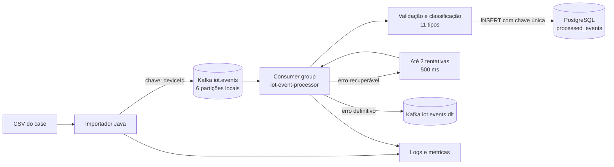

# Arquitetura e operação

## Fluxo implementado

1. `POST /api/imports/sample` abre o CSV configurado em `CASE_CSV_PATH` e processa cada linha. O campo `body_completo` é o payload original; `msgType` e o identificador do dispositivo são verificados contra as colunas do CSV. Em `informationTransfer`, o identificador vem de `deviceId`, pois `did` está vazio.
2. O envelope traz versão, `eventId`, número da amostra, dispositivo, tipo, horário do log e JSON original. O `eventId` é SHA-256 do JSON normalizado. O produtor usa o dispositivo como chave e espera a confirmação do broker para cada publicação, decisão simples e verificável para 100 mensagens.
3. O consumidor lê `iot.events`, classifica os 11 tipos e insere categoria e resumo no PostgreSQL. O JSON original não é gravado no banco. A chave primária de `event_id` faz o replay retornar como duplicata sem alterar o resultado.
4. Erros de validação são definitivos. Falhas transitórias recebem até duas tentativas; depois o registro vai para `iot.events.dlt`. A publicação na DLT é confirmada antes de considerar a recuperação concluída.
5. Logs trazem ID, tipo, dispositivo, partição, offset e resultado, sem imprimir o corpo JSON. Métricas expostas pelo Actuator/Prometheus contam publicação, rejeição, processamento, duplicidade e encaminhamento à DLT.

## Ordenação e paralelismo

O Kafka garante ordem **dentro da partição**, não ordem total entre partições. A chave do dispositivo mantém os eventos do mesmo dispositivo na mesma partição; isso preserva a ordem de **publicação** por dispositivo. O CSV não está ordenado cronologicamente e seus `utcTime` têm formatos diferentes. A aplicação mantém o horário do log como dado, sem presumir que eventos atrasados sejam atuais.

As seis partições locais mostram o modelo de paralelismo. Em produção, o número deve ser escolhido com base na taxa de pico, tamanho das mensagens, custo do handler, lag e distribuição das chaves. Aumentar consumidores no mesmo grupo só aumenta o paralelismo útil até o número de partições. Dispositivos muito ativos podem criar partições quentes; monitorar a distribuição antes de mudar a chave, porque a escolha afeta a ordem por dispositivo.

O retry ocorre na partição e pode bloquear temporariamente outros eventos dela. Como são duas pausas de 500 ms, a demonstração permanece simples e preserva a sequência do consumidor. Retry em tópico separado reduziria o bloqueio, mas permitiria ultrapassagem de mensagens do mesmo dispositivo. Eventos que excedem o limite seguem para DLT, permitindo que a partição avance. A DLT exige inspeção, correção da causa e política explícita de reenvio; não há replay automático cego.

## Idempotência e limites

Para esta amostra sem ID universal, o hash do `body_completo` identifica um evento ao reimportar o mesmo CSV. Isso detecta duplicatas com JSON de conteúdo e ordem de campos iguais. Um payload semanticamente igual com ordem diferente de campos pode gerar outro hash; dois eventos legítimos com payload exatamente igual podem ser confundidos. Em produção, o produtor de origem deve enviar um ID de evento estável. A chave única do banco protege o efeito implementado aqui, mas não transforma efeitos futuros em serviços externos em operações exatamente uma vez.

O banco é a projeção da demonstração: registra classificação, dispositivo, tipo e resumo, sem comandar dispositivos ou emitir notificações. Se o domínio exigir estado atual por dispositivo, acrescentar uma tabela de estado com controle de versão/horário e tratamento explícito de eventos atrasados.

## Crescimento e disponibilidade

Um milhão de eventos por dia equivale a cerca de 12 eventos por segundo **em média**; dez milhões, cerca de 116/s. Isso não dimensiona o sistema: picos, tamanho do payload e tempo de processamento podem dominar. Para produção, medir throughput e lag em carga semelhante à real, provisionar múltiplos brokers e réplicas, aumentar consumidores até o limite das partições, configurar retenção, quotas, segurança de transporte e autenticação, e manter PostgreSQL com HA e índices apropriados. O broker único do Compose é apenas para execução local.

Alertas úteis: lag crescente, taxa de DLT, falhas de publicação, rejeição do CSV, taxa de duplicatas anormal, latência de processamento, indisponibilidade de Kafka/PostgreSQL e capacidade de disco. Health e métricas são expostos pelo Actuator; um monitor externo faria os alertas em produção.

Os 100 eventos demonstram funcionalidade. Nenhuma conclusão de capacidade para milhões/dia foi obtida a partir da amostra.
